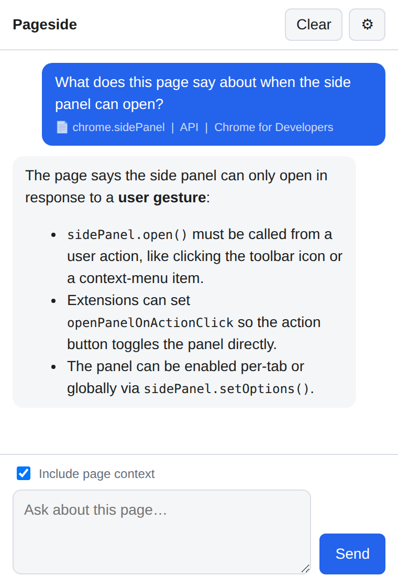

# Pageside

[](https://github.com/chadcarpenter/sidenote/actions/workflows/ci.yml)

A minimal Chrome (Manifest V3) side-panel extension: a chat sidebar about the page you're on — in the spirit of Dia browser's sidebar — that talks to **any OpenAI-compatible endpoint**.

It is a hard-fork distillation of [hermes-browser-extension](https://github.com/abundantbeing/hermes-browser-extension) by Jon Komet: the page-capture pipeline and its untrusted-content security model are kept nearly intact; the sessions/skills/themes/tools/voice/cloud UI is gone.



## What it does

- One transcript, one **"Ask about this page…"** textarea, one **Include page context** toggle.
- Streams replies from `POST {baseUrl}/v1/chat/completions` (SSE), with a Stop button mid-stream.
- With the toggle on, the active tab's readable text, selection, and metadata are wrapped in `UNTRUSTED_BROWSER_CONTEXT` delimiters and attached to your message. Only the current turn carries page context — history goes up as plain text.
- The last conversation persists across panel closes; **Clear** wipes it.

## Security model (inherited from Hermes Browser Extension)

- Page content is treated as untrusted data: delimited in the prompt, rendered in the UI via `textContent` (assistant markdown goes through a reviewed escaping renderer; markdown images render as links, never ``).
- Secrets (API keys, tokens, JWTs, private keys, `key=value` assignments) are redacted at capture **and** again at prompt build.
- Restricted URLs are never read: browser internals (`chrome://`, `file:` …), credential-bearing URLs, and sensitive pages (banks, crypto, password managers, checkout/billing/payments, medical, tax).
- No always-on content script: the capture script is injected on demand into the active tab only when you send a message with the context toggle on.

Found a weakness in any of this? See [SECURITY.md](SECURITY.md).

## Install (load unpacked)

1. Open `chrome://extensions`, enable **Developer mode**, click **Load unpacked**, and select this repo's `extension/` folder.
2. Click the Sidenote toolbar button — the side panel opens and settings appear on first run.
3. Set **Base URL**, **API key** (blank if the server needs none), and **Model**.

While developing, load it in a dedicated Chrome profile to keep it isolated from your daily-driver profile.

### Endpoint examples

| Server | Base URL | API key |
| --- | --- | --- |
| Ollama (default) | `http://127.0.0.1:11434` | leave blank |
| LM Studio | `http://127.0.0.1:1234` | leave blank |
| Hermes local gateway | `http://127.0.0.1:8642` | gateway token |
| OpenAI-compatible cloud | `https://…` | provider key |

Base URLs with or without a trailing `/v1` both work.

## Development

No build step, no dependencies — the extension loads straight from `extension/`.

```sh
npm run verify   # node --test tests/*.test.mjs + syntax checks
```

The same command runs in CI on every push and pull request.

Layout:

- `extension/sidepanel.{html,css,js}` — the whole UI and chat loop
- `extension/content.js` — capture script, injected on demand via `chrome.scripting` (classic script, cannot import modules, hence its inline redaction mirror)
- `extension/lib/browser-context-protocol.mjs` — prompt assembly, restricted-URL privacy guard
- `extension/lib/redaction.mjs` — secret redaction (canonical copy)
- `extension/lib/sse.mjs` — OpenAI SSE stream parsing
- `extension/lib/markdown.mjs` — escaping markdown renderer (no image loading by design)
- `extension/icons/` — toolbar/store icons, rendered from `icon.svg`

## License

MIT — see [LICENSE](LICENSE). Derived from [hermes-browser-extension](https://github.com/abundantbeing/hermes-browser-extension), © 2026 Jon Komet.
